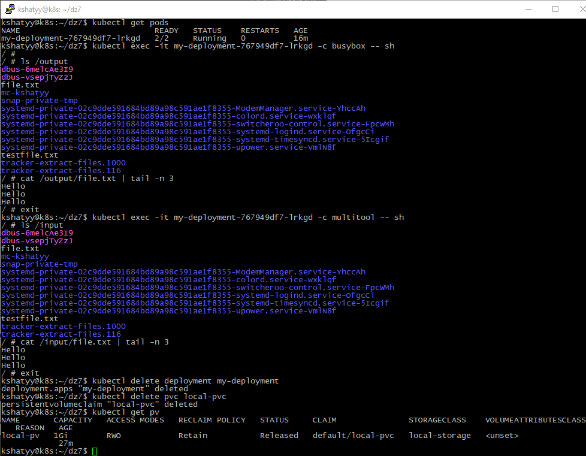
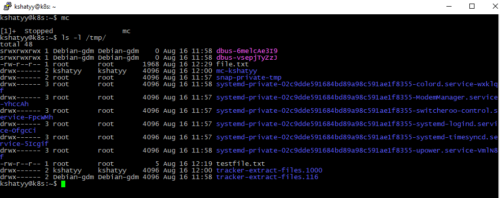
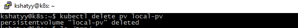
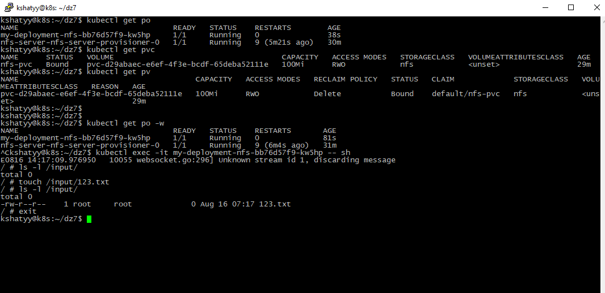

# Домашнее задание к занятию "`Хранение в K8s. Часть 2`" - `Шатый Константин`

### Инструкция по выполнению домашнего задания

   1. Сделайте `fork` данного репозитория к себе в Github и переименуйте его по названию или номеру занятия, например, https://github.com/имя-вашего-репозитория/git-hw или  https://github.com/имя-вашего-репозитория/7-1-ansible-hw).
   2. Выполните клонирование данного репозитория к себе на ПК с помощью команды `git clone`.
   3. Выполните домашнее задание и заполните у себя локально этот файл README.md:
      - впишите вверху название занятия и вашу фамилию и имя
      - в каждом задании добавьте решение в требуемом виде (текст/код/скриншоты/ссылка)
      - для корректного добавления скриншотов воспользуйтесь [инструкцией "Как вставить скриншот в шаблон с решением](https://github.com/netology-code/sys-pattern-homework/blob/main/screen-instruction.md)
      - при оформлении используйте возможности языка разметки md (коротко об этом можно посмотреть в [инструкции  по MarkDown](https://github.com/netology-code/sys-pattern-homework/blob/main/md-instruction.md))
   4. После завершения работы над домашним заданием сделайте коммит (`git commit -m "comment"`) и отправьте его на Github (`git push origin`);
   5. Для проверки домашнего задания преподавателем в личном кабинете прикрепите и отправьте ссылку на решение в виде md-файла в вашем Github.
   6. Любые вопросы по выполнению заданий спрашивайте в чате учебной группы и/или в разделе “Вопросы по заданию” в личном кабинете.
   
Желаем успехов в выполнении домашнего задания!
   
### Дополнительные материалы, которые могут быть полезны для выполнения задания

# Задание 1. 

# PersistentVolumes (PV) — это ресурсы в Kubernetes, которые представляют собой куски хранилища в кластере. Они существуют независимо от жизненного цикла Pod-ов и могут быть использованы для хранения данных, которые должны сохраняться между перезапусками Pod-ов. Вот основные моменты, которые стоит знать о PersistentVolumes:

Независимость от Pod-ов:

PersistentVolumes существуют отдельно от Pod-ов и могут быть использованы разными Pod-ами в разное время. Это позволяет сохранять данные, даже если Pod-ы создаются и удаляются.
Жизненный цикл:

PV сохраняет данные независимо от состояния Pod-ов. Даже если Pod будет удален или пересоздан, данные на PV сохранятся. Это важно для случаев, когда данные должны сохраняться между перезапусками или перемещением Pod-ов.
Связывание с PersistentVolumeClaims (PVC):

Pod использует PersistentVolumeClaims (PVC) для запроса хранилища у PersistentVolume. PVC описывает потребности Pod-а в хранилище, такие как объем, тип доступа и классы хранилища. Kubernetes затем связывает PVC с соответствующим PV.
Классы хранилища и динамическое выделение:

Kubernetes поддерживает Storage Classes, которые позволяют автоматически выделять и управлять PV для PVC. При создании PVC с указанием класса хранилища, Kubernetes может динамически создать подходящий PV для удовлетворения требований PVC.
Политики удержания (Reclaim Policy):

PV имеет политику удержания, которая определяет, что делать с хранилищем после того, как PVC будет удален. Политики включают Retain (сохранить данные), Recycle (освободить данные и вернуть в пул) и Delete (удалить данные и хранилище).
Типы хранилищ:

PV может быть создано на основе различных типов хранилищ, включая локальные диски, NFS, облачные хранилища и другие типы.
В целом, PersistentVolumes позволяют Kubernetes управлять хранилищем данных в кластере, предоставляя гибкость и долговечность данных для контейнеризованных приложений.

# Удаление PersistentVolume (PV) удаляет только объект PV в Kubernetes и его ссылку на хранилище. Вот что происходит при удалении PV:

Удаление ссылки на хранилище:

Когда вы удаляете объект PV в Kubernetes, вы удаляете только метаданные и ссылку на это хранилище из самого Kubernetes. Kubernetes больше не будет отслеживать этот PV, и любые PersistentVolumeClaims (PVC), которые были привязаны к этому PV, больше не будут иметь доступа к этому хранилищу.
Сохранение данных:

Данные в самом хранилище остаются нетронутыми. Физические данные, хранящиеся на диске или в облаке, не удаляются автоматически. Это означает, что данные, которые были на этом PV, все еще будут доступны и сохранены в хранилище после удаления PV, если только вы не примените дополнительные действия.
Политики удержания (Reclaim Policy):

Поведение после удаления PV может зависеть от установленной политики удержания:
Retain: Данные сохраняются, и хранилище не удаляется. Администратор должен вручную управлять и очищать данные, если это необходимо.
Recycle: Хранилище очищается и возвращается в пул доступных ресурсов для повторного использования.
Delete: Хранилище и данные удаляются вместе с PV (это может применяться к динамически созданным PV, когда используемые хранилища поддерживают удаление данных).
Необходимость ручного удаления:

Если политика удержания установлена на Retain, администратор кластера должен самостоятельно управлять хранилищем и данными после удаления PV. Это может включать в себя удаление или очистку данных вручную.
Таким образом, удаление PV в Kubernetes освобождает ресурсы кластера, но не обязательно удаляет данные, которые хранятся на хранилище. Это обеспечивает гибкость в управлении хранилищем и данных в зависимости от требований и конфигурации.

# Задание 2. 

